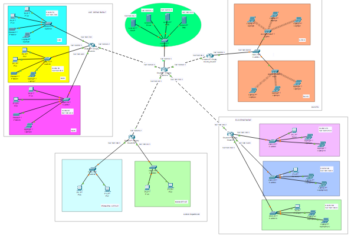
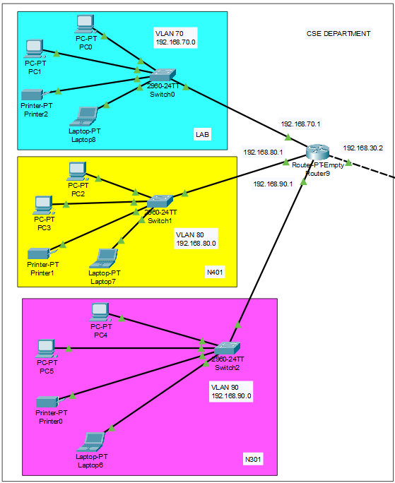
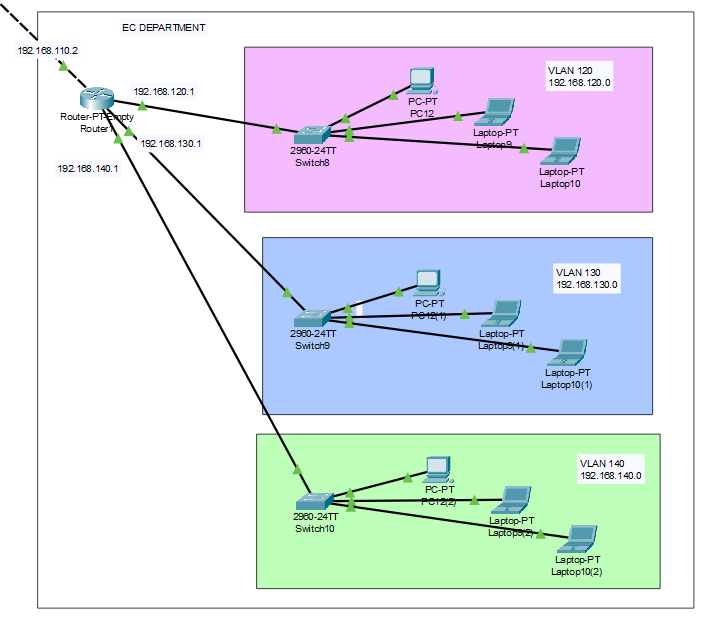
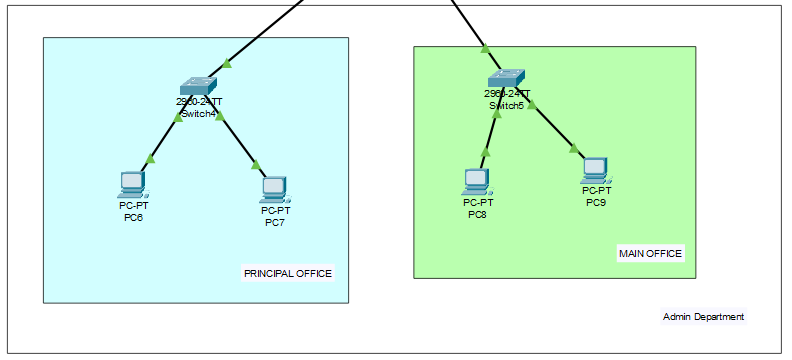
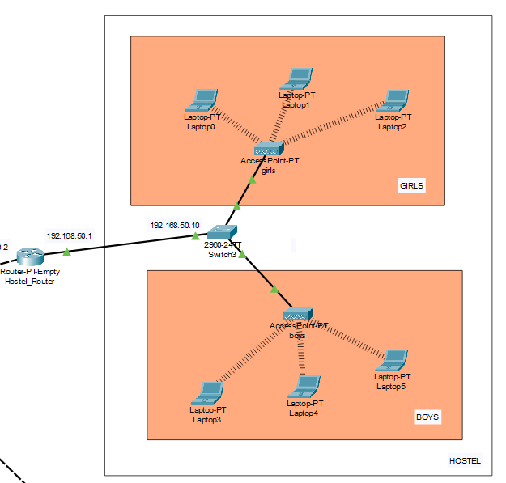

# 🎓 University Campus Area Network (CAN) — Cisco Packet Tracer

> A fully simulated Campus Area Network demonstrating enterprise-grade segmentation, dynamic routing, and multi-service integration using Cisco Packet Tracer.

---

## 📌 Overview

This project implements a **scalable and secure Campus Area Network (CAN)** for a university environment. Built entirely in **Cisco Packet Tracer**, it models a real-world network infrastructure that serves multiple departments — each isolated into its own VLAN — while sharing centralized services like DHCP, DNS, Web, and Email.

The design showcases:
- Department-level network **isolation via VLANs**
- **Dynamic inter-VLAN routing** using RIP v2
- **Centralized service delivery** (DHCP, DNS, Web, Email)
- **Scalable topology** that mirrors a real university deployment

---

## 🗺️ Network Architecture

```
                        ┌──────────────────────┐
                        │     Core Router       │
                        │   (RIPv2 Enabled)     │
                        └────────┬─────────────┘
                                 │
              ┌──────────────────┼──────────────────┐
              │                  │                  │
     ┌────────▼───────┐ ┌────────▼──────┐ ┌────────▼──────┐
     │  Layer 3 Dist. │ │  Layer 3 Dist.│ │  Server Farm  │
     │   Switch (CSE) │ │  Switch (EC)  │ │  (Centralized)│
     └──────┬─────────┘ └────────┬──────┘ └───────┬───────┘
            │                    │                 │
   ┌────────┼──────┐       ┌─────┼─────┐    ┌─────┼──────────┐
   │        │      │       │     │     │    │     │    │      │
  CSE     CSE    CSE      EC    EC   Admin DHCP  DNS  Web  Email
 VLAN70  VLAN80 VLAN90  VLAN  VLAN  VLAN40  Srv   Srv  Srv   Srv
                         120   130
```

### Key Design Principles

- **Hierarchical 3-tier topology**: Core → Distribution → Access layers
- **Redundancy-ready** structure with modular department blocks
- **Centralized server farm** accessible to all VLANs via routing
- **Per-department subnets** for clean IP address management

---

## 🔧 Features

### Network Segmentation
- Each department is assigned a **dedicated VLAN** with its own IP subnet
- Prevents broadcast domain overlap and improves security posture
- Access Control enforced at the VLAN boundary

### Dynamic Routing (RIPv2)
- **RIP version 2** configured on all inter-department routers
- Supports **classless routing** with subnet mask advertisement
- Auto-propagates routes — no manual static entries needed across departments

### DHCP (Automatic IP Assignment)
- **Centralized DHCP server** handles IP allocation for all VLANs
- Separate DHCP pools per VLAN with correct default gateways
- Eliminates manual IP configuration on end devices

### DNS (Name Resolution)
- Internal DNS server resolves hostnames for university resources
- Enables user-friendly access (e.g., `webserver.university.local`)

### Web & Email Servers
- **Web Server** hosts the university intranet portal, reachable from all VLANs
- **Email Server** enables internal communication between departments

---

## 📋 VLAN Configuration Table

| VLAN ID     | Department       | Subnet            | Purpose                          |
|-------------|------------------|-------------------|----------------------------------|
| `40`        | Administration   | 192.168.40.0/24   | Administrative staff network     |
| `50`        | Hostel           | 192.168.50.0/24   | Student hostel connectivity      |
| `70`        | CSE (Lab A)      | 192.168.70.0/24   | CSE undergraduate lab            |
| `80`        | CSE (Lab B)      | 192.168.80.0/24   | CSE postgraduate / research      |
| `90`        | CSE (Faculty)    | 192.168.90.0/24   | CSE faculty workstations         |
| `120`       | EC (Lab)         | 192.168.120.0/24  | EC academic resources            |
| `130`       | EC (Faculty)     | 192.168.130.0/24  | EC faculty and research network  |

> Each VLAN is isolated at Layer 2. Inter-VLAN communication is permitted only through the Layer 3 router using RIPv2-advertised routes.

---

## ⚙️ Protocols & Services Summary

| Protocol / Service | Role                                              | Scope         |
|--------------------|---------------------------------------------------|---------------|
| **RIP v2**         | Dynamic routing between all VLANs and routers     | Network-wide  |
| **DHCP**           | Automatic IP allocation per VLAN pool             | All VLANs     |
| **DNS**            | Hostname-to-IP resolution for internal services   | All VLANs     |
| **HTTP (Web)**     | University intranet website hosting               | All VLANs     |
| **SMTP (Email)**   | Internal email communication                      | All VLANs     |
| **802.1Q Trunking**| VLAN tagging across switch uplinks               | Switch uplinks |

---

## 🖼️ Network Topology Screenshots

### Main Campus Overview

> Full campus topology showing core routing, server farm, and department distribution blocks.

### CSE Department

> Three VLANs (70, 80, 90) covering undergraduate labs, postgraduate lab, and faculty zone.

### EC Department

> Two VLANs (120, 130) for EC academic labs and faculty workstations.

### Administration Department

> VLAN 40 for administrative staff, connected to all centralized services.

### Hostel Department

> VLAN 50 providing student hostel users with internet access and internal services.

---

## 🚀 Getting Started

### Prerequisites
- [Cisco Packet Tracer](https://www.netacad.com/courses/packet-tracer) v8.0 or later

### Running the Simulation

1. **Clone this repository**
   ```bash
   git clone https://github.com/your-username/university-campus-network.git
   cd university-campus-network
   ```

2. **Open the project file**
   ```
   Open Cisco Packet Tracer → File → Open → campus_network.pkt
   ```

3. **Verify connectivity**
   - Use the `ping` tool between devices across different VLANs
   - Open a browser on any PC and navigate to `http://webserver.university.local`
   - Test email delivery between department PCs

4. **Inspect DHCP leases**
   - Click any end device → Desktop → IP Configuration → DHCP → verify assigned IP

---

## 📁 Project Structure

```
university-campus-network/
├── campus_network.pkt       # Main Packet Tracer simulation file
├── README.md                # Project documentation (this file)
└── Images/
    ├── Main.png             # Full campus overview
    ├── CSE.png              # CSE department topology
    ├── EC.png               # EC department topology
    ├── Admin.png            # Administration topology
    └── Hostel.png           # Hostel topology
```

---

## 📚 Learning Outcomes

By studying or extending this project, you will understand:

- How to configure and verify **VLANs** on Cisco switches using `switchport access vlan` and `switchport trunk`
- How **RIP v2** propagates subnet information dynamically
- How to set up a **DHCP server** with multiple address pools for different subnets
- Inter-VLAN routing using a **router-on-a-stick** or Layer 3 switch approach
- How DNS, Web, and Email services are integrated into an enterprise LAN

---

## 🛠️ Technologies Used


---

## 🤝 Contributing

Contributions, suggestions, and improvements are welcome!

1. Fork this repository
2. Create a new branch: `git checkout -b feature/your-feature`
3. Commit your changes: `git commit -m "Add: your improvement"`
4. Push to the branch: `git push origin feature/your-feature`
5. Open a Pull Request

---

## 📄 License

This project is licensed under the **MIT License** — see the [LICENSE](LICENSE) file for details.

---

<div align="center">

Made with ❤️ using Cisco Packet Tracer

*Simulating real-world networks, one VLAN at a time.*

</div>
